<div align="center">


</div>

<div align="center">

# POC - Observability com Springboot e Java
Trata-se de uma aplicação de prova de conceito para aplicar Observability utilizando Spring boot e Java


<b>Ferramentas de Observability</b>


</div>

## Fundamentos teóricos

- ### Jaeger
  > Jaeger é um software open source para rastreamento de transações entre serviços distribuídos. Ele é usado para monitorar e solucionar problemas em ambientes de microsserviços complexos.
- ### Prometheus
  > Prometheus é um sistema de monitoramento para serviços e aplicações. Ele coleta as métricas de seus alvos em determinados intervalos, avalia expressões de regras, exibe os resultados e também pode acionar alertas se alguma condição for observada como verdadeira.
- ### Grafana
  > Grafana é uma aplicação web de análise de código aberto multiplataforma e visualização interativa da web. Ele fornece tabelas, gráficos e alertas para a Web quando conectado a fontes de dados suportadas. É expansível através de um sistema de plug-in.
- ### Springboot
  > O Spring Boot é um projeto da Spring que veio para facilitar o processo de configuração e publicação de nossas aplicações. A intenção é ter o seu projeto rodando o mais rápido possível e sem complicação.
- ### Java
  > Java é uma linguagem de programação orientada a objetos desenvolvida na década de 90 por uma equipe de programadores chefiada por James Gosling, na empresa Sun Microsystems. Em 2008 o Java foi adquirido pela empresa Oracle Corporation.

## Tecnologias
- Java 11
- Spring Boot 2.5.0
    - spring-boot-starter-actuator
    - spring-boot-starter-web
    - spring-boot-starter-data-jpa
    - opentracing-spring-jaeger-web-starter
    - opentracing-jdbc
    - micrometer-registry-prometheus
    - spring-boot-devtools
    - mapstruct
    - flyway-core
    - postgresql
    - lombok
- Tomcat (Embedded no Spring Boot)
- Git

## Execução

- Scripts
  ### Executar docker-compose
    - 1° comando: ``` cd src/main/docker/```
    - 2° comando: ```docker-compose -f docker-compose.yml up```
  ### Executar a aplicação
    -  ```./mvnw clean compile spring-boot:run```

## Utilização

- ### Jaeger
        http://localhost:16686/
  - Na opção service podemos selecionar a o microserviço e clicar no find trances e será retornado os traces da aplicação.

    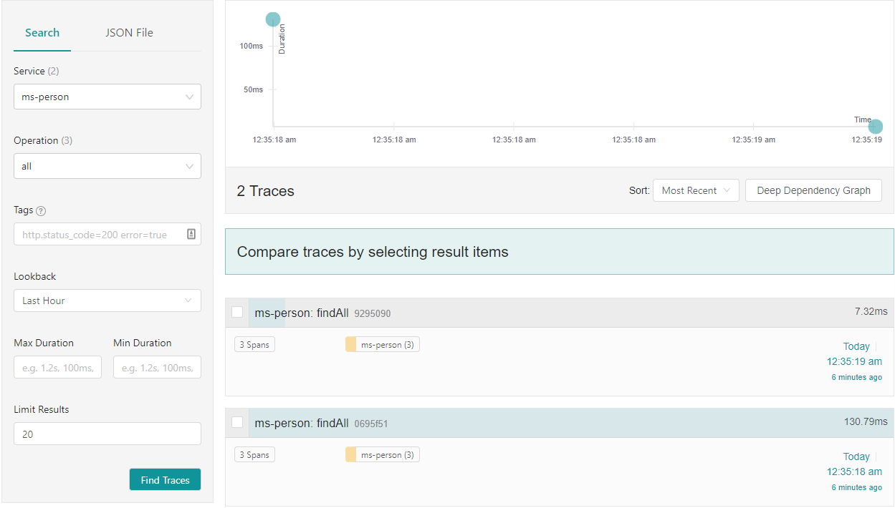
- ### Prometheus
        http://localhost:9090/
  - O Prometeus disponibiliza a funções, onde por exemplo a *http_server_requests_seconds_count* que disponibiliza a quantidade de request em um determinado recurso do microserviço, além de demonstrar em formato de tabela e gráfico.
  
    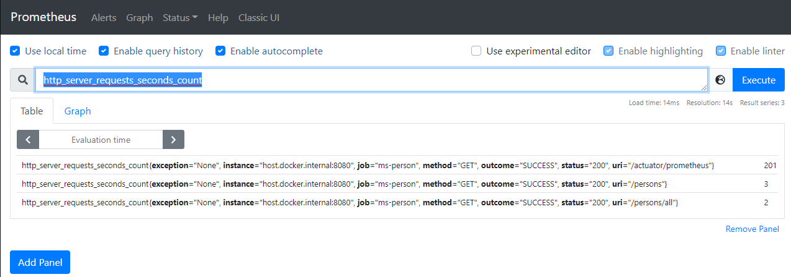
    
    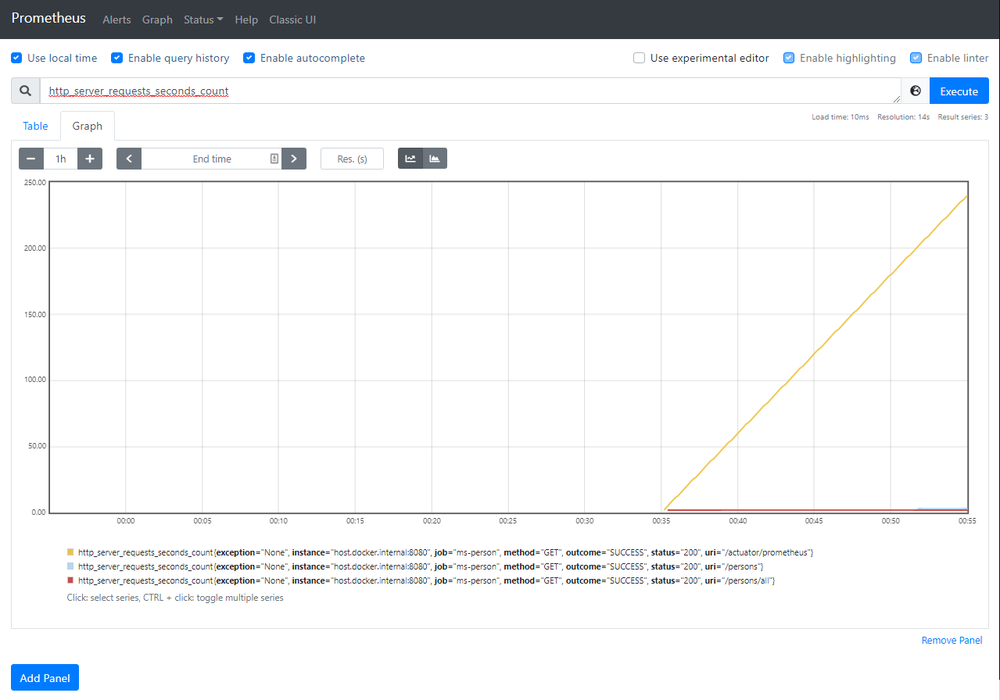
    
  - O Prometeus também disponibiliza a funcão de verificar a status do microserviço a partir do menu superior status.
  
    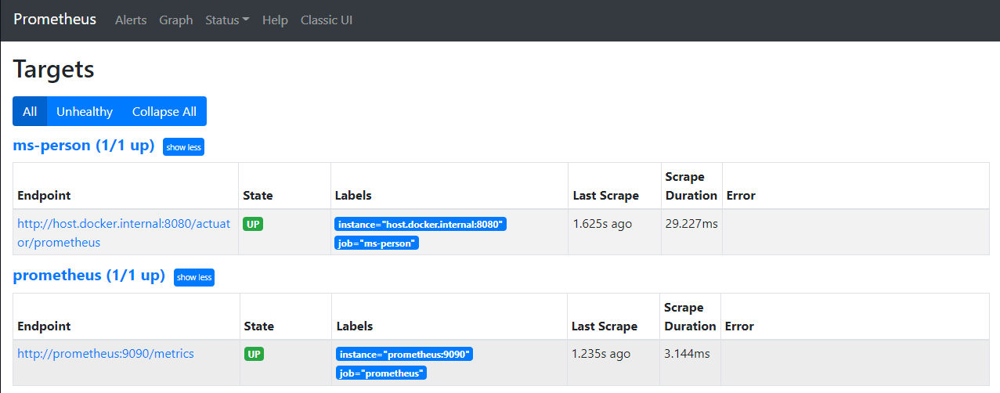
    
- ### Grafana
        http://localhost:3000/login
        Email or username: admin
        Password: admin
  - Tela de Login
  
  
  
  - Tela Inicial
  
  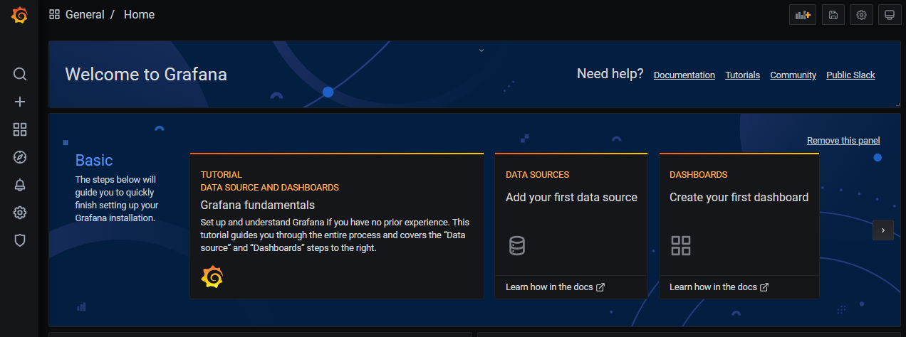
  
  - Criação dos Data Source Jaeger
    - 1° Clique em Add data source
    - 2° Selecione a opção de Jaeger
    
    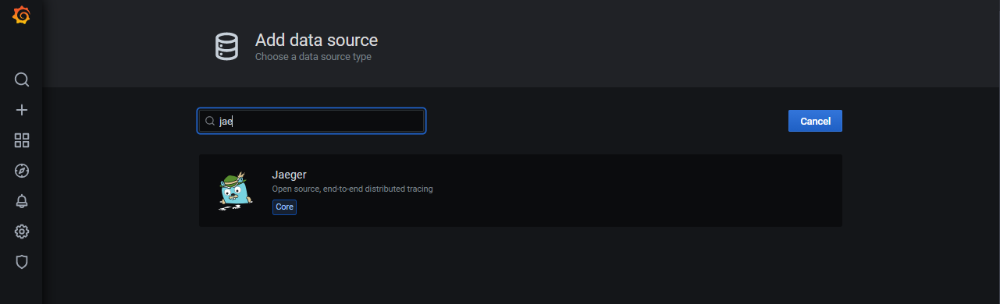
    
    - 3° Configuração é bem simples so incluir o http://jaeger:16686 no input da URL e clicar em
      Save & Test:
      
    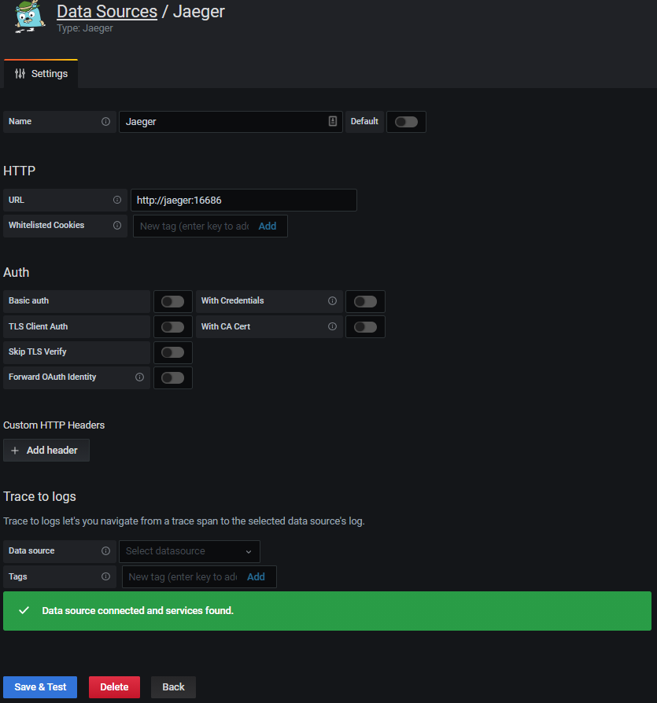
  - Vizualizar os traces Jaeger
    - 1° Na página inicial do Grafana clique em Explore e selecione Jaeger
    - 2° Clique em Traces nome do microserviço e selecione a operação desejada e ele retorna o trance.

    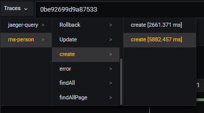
    
    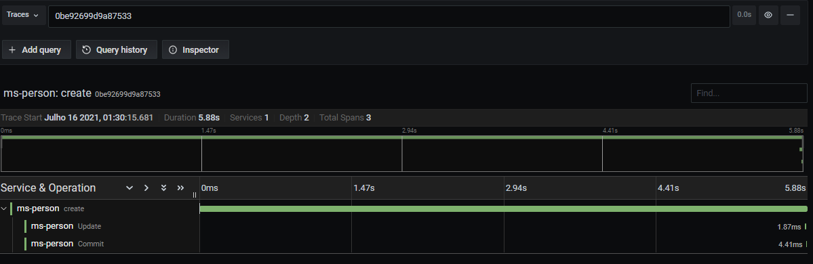

  - Criação dos Data Source Prometheus
    - 1° Clique em Add data source
    - 2° Selecione a opção de Prometheus
    
    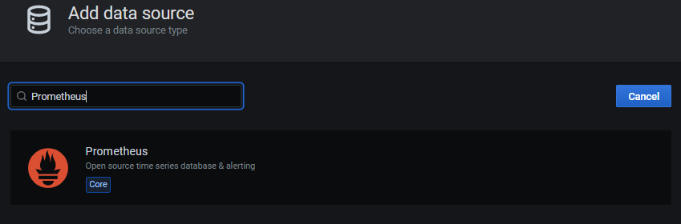
  
    - 3° Configuração é bem simples so incluir o http://prometheus:9090 no input da URL e clicar em 
      Save & Test:

    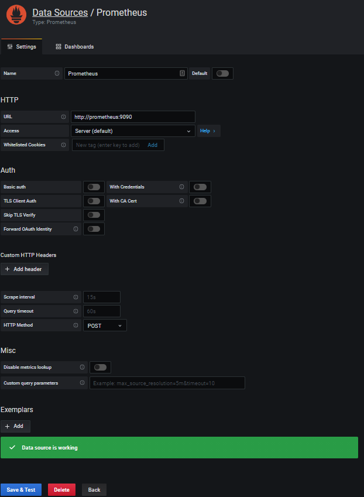
  
  - Criando um Dashboard Prometheus
   - 1° Na página inicial do Grafana clique em create your first dashboard
   - 2° Clique em Add an empty panel
   - 3° Na opção query options selecione Prometheus
   - 4° No Painel Visualization selecione o Gauge
   - 5° Em Metrics no painel Query estão disponíveis os endpoints fornecidos pelo Prometheus:
   - 6° Na opção metrics no painel query estão os recursos disponibilizados pelo prometheus:
   - 7° Podemos utilizar varios filtros e varios tipos de lengendas para cada grafico:
     - http_server_requests_seconds_count{job="ms-person", uri="/persons", method="GET", status="200"}
     - {{uri}}/{{method}} | HTTPCODE: {{status}}
     - http_server_requests_seconds_count{job="ms-person", uri="/persons", method="GET", status="200"}
     - {{uri}}/{{method}} | HTTPCODE: {{status}}
     - http_server_requests_seconds_count{job="ms-person", uri="/persons", method="GET", status="200"}
     - {{uri}}/{{method}} | HTTPCODE: {{status}}  |  Exception: {{exception}}

    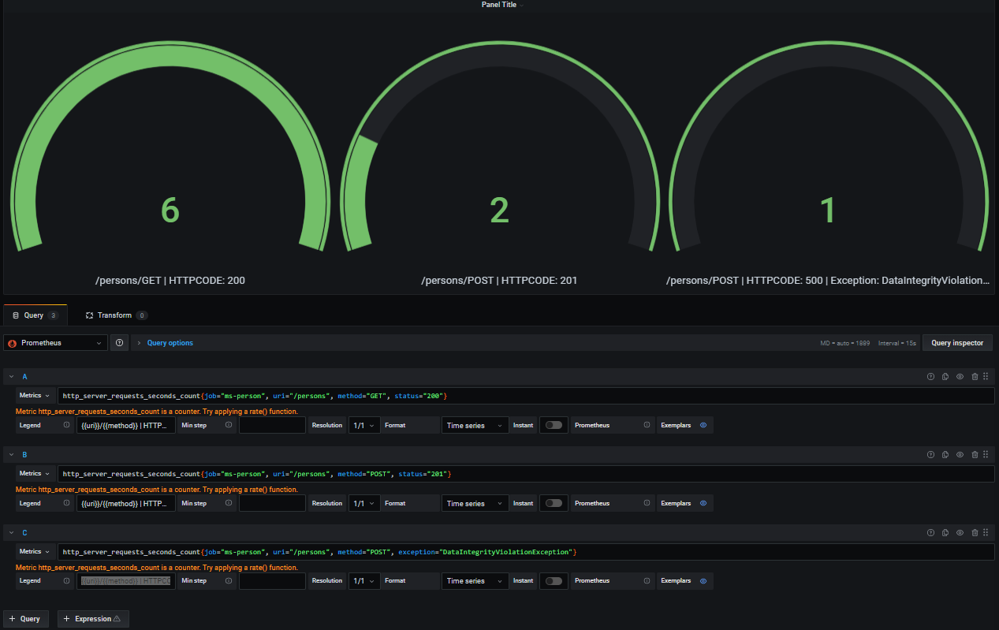 